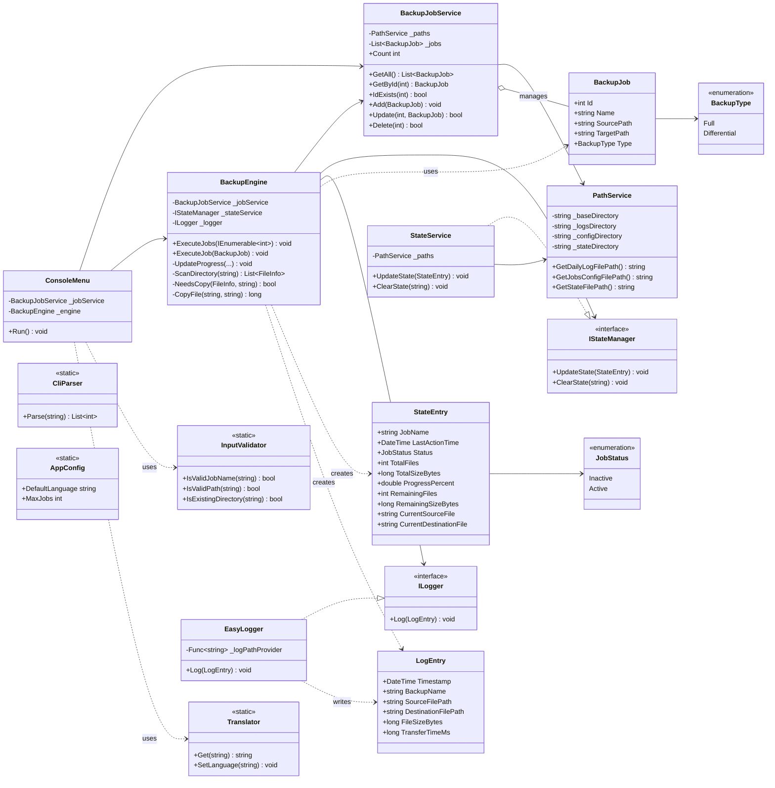
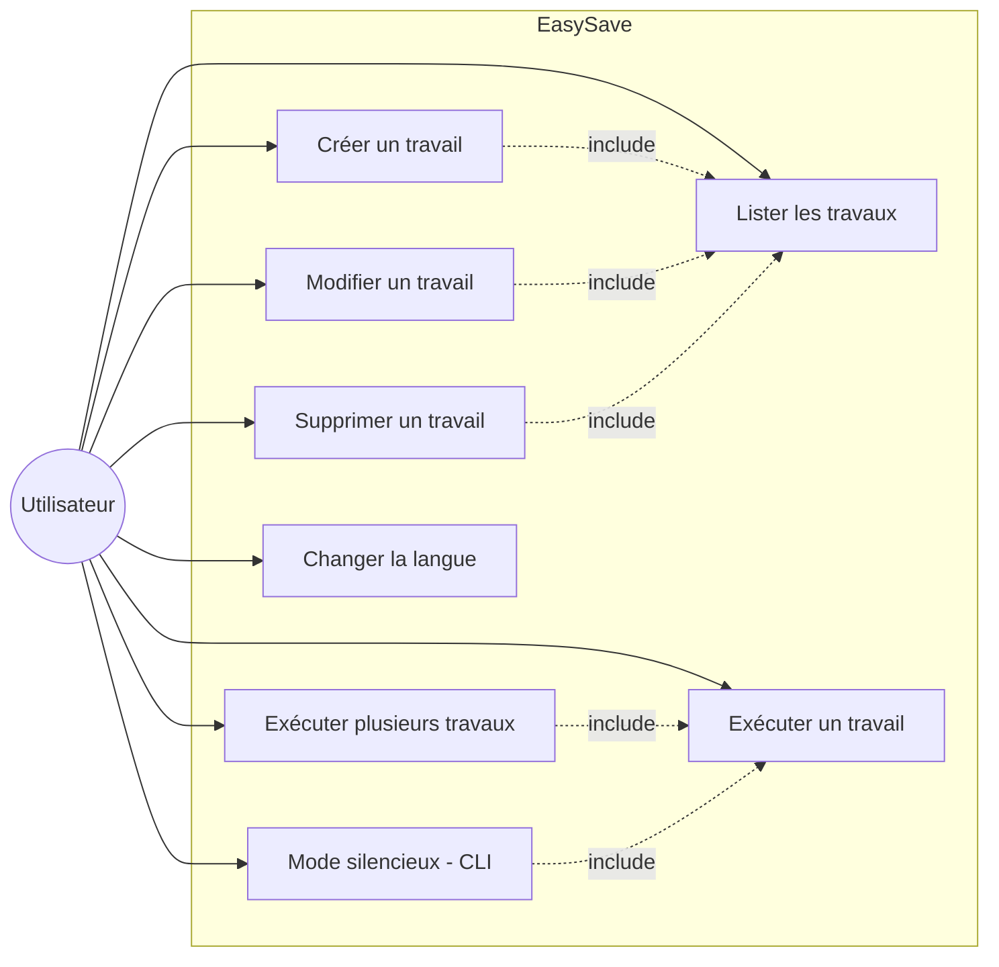
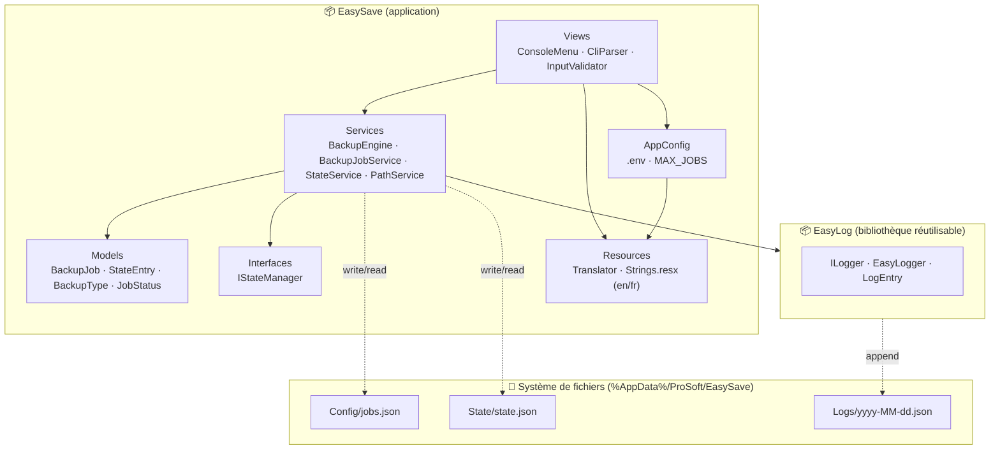
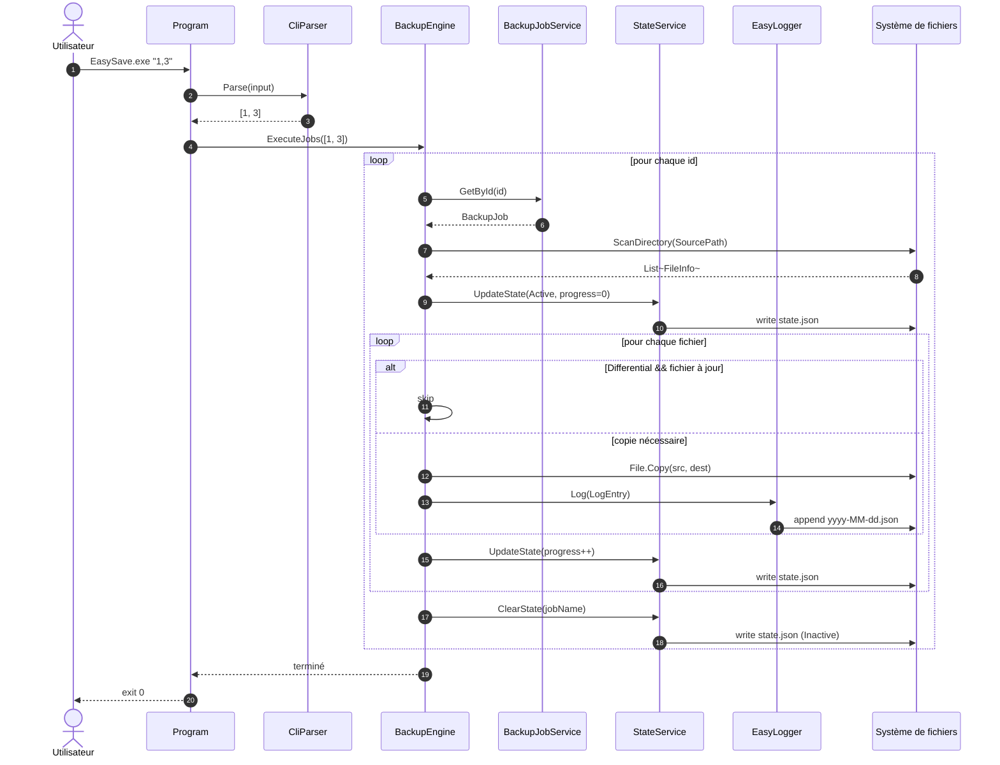
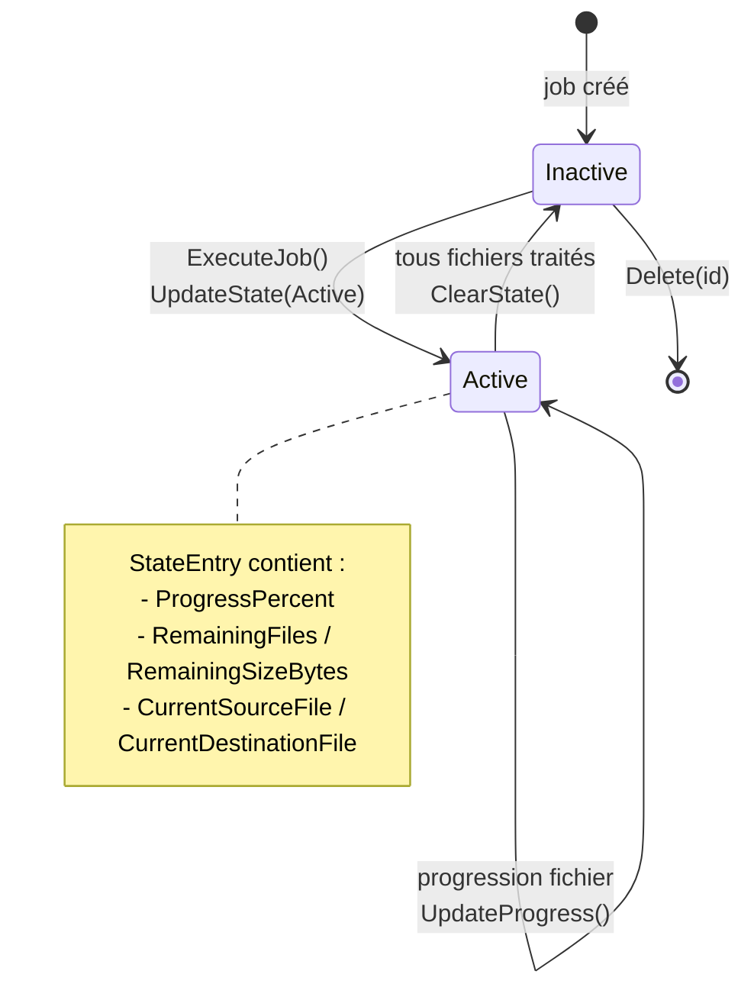
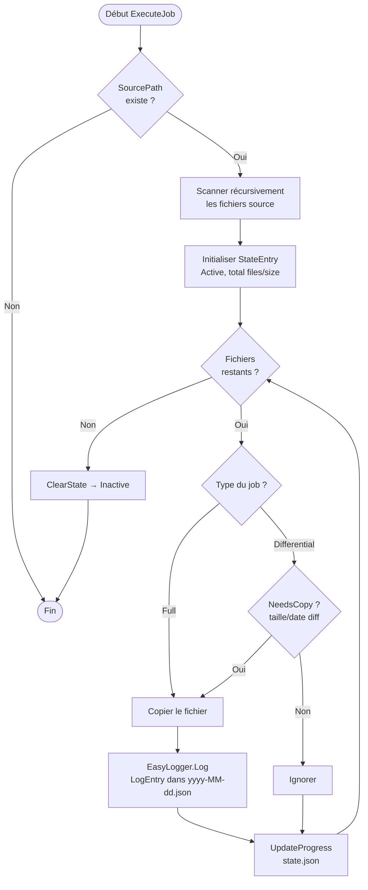

# Diagrammes UML — EasySave

Diagrammes Mermaid pour la présentation du projet **EasySave** (v1.0 — console, sauvegarde complète/différentielle, mode CLI silencieux, i18n) et de la bibliothèque **EasyLog**.

---

## 1. Diagramme de classes

---

## 2. Diagramme de cas d'utilisation

---

## 3. Diagramme de composants / packages

---

## 4. Diagramme de séquence — Exécution en mode silencieux (ex. EasySave.exe "1;3")

---

## 5. Diagramme d'états — cycle de vie d'un `BackupJob` (via `JobStatus`)

---

## 6. (Bonus) Diagramme d'activité — choix Full vs Differential

