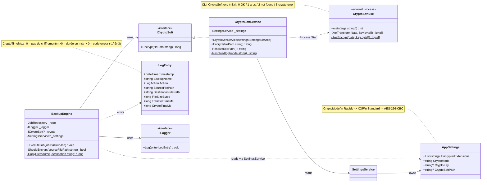
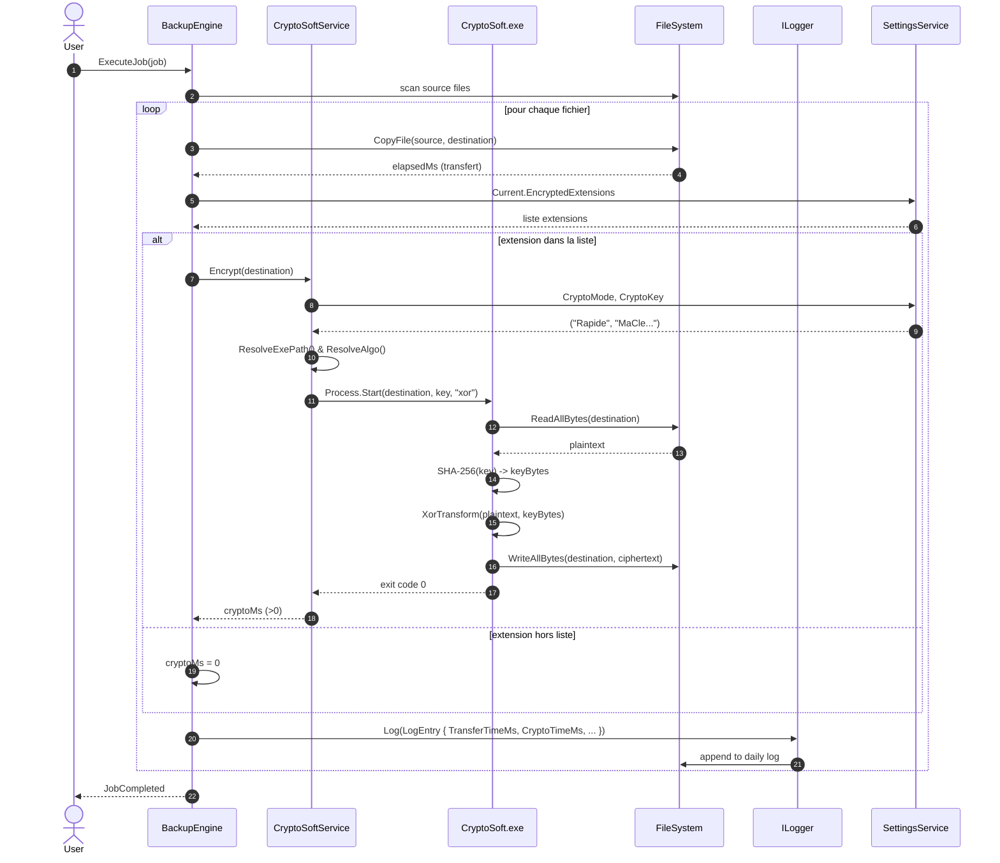
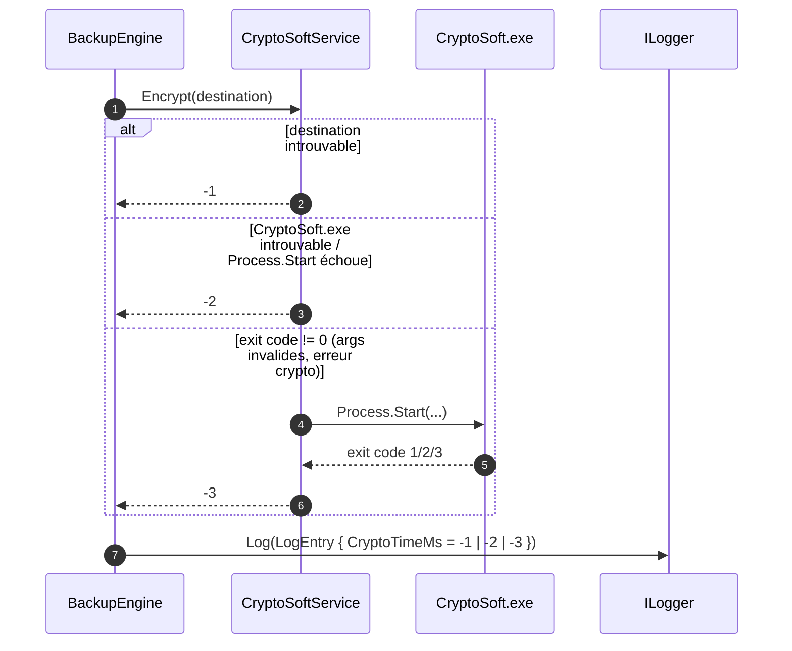

# Diagrammes UML — EasySave 2.0 (Cryptage)

Diagrammes Mermaid pour les évolutions **2.0**: intégration du chiffrement via le logiciel externe **CryptoSoft**, et enrichissement de `LogEntry` avec le temps de chiffrement.

---

## 1. Diagramme de classes — Chiffrement

Périmètre: contrat `ICryptoSoft`, implémentation `CryptoSoftService` (lance l'exe externe), évolution de `LogEntry`, points d'intégration côté `BackupEngine` et `AppSettings`.

---

## 2. Diagramme de séquence — Sauvegarde avec chiffrement

Flux d'un fichier dont l'extension figure dans `AppSettings.EncryptedExtensions`. Cas nominal en mode **Rapide** (XOR). Pour le mode **Standard**, seul l'argument `algo` passé à l'exe change (`aes` au lieu de `xor`).

### Variantes d'erreur (CryptoTimeMs négatif)

---

## 3. Notes de conception

- **Chiffrement en place**: l'exe écrase le fichier de destination — la source reste intacte. Best practice pour un backup-at-rest qui ne doit jamais réexposer le clair côté cible.
- **Dérivation de clé**: la passphrase `CryptoKey` est hashée en SHA-256 dans CryptoSoft pour produire 256 bits, utilisés tels quels par AES-256-CBC, ou en clé répétée pour XOR.
- **IV AES**: généré aléatoirement à chaque chiffrement et préfixé au ciphertext (`IV || ciphertext`).
- **Mesure de la durée**: c'est `CryptoSoftService` (côté EasySave) qui chronomètre l'appel `Process.Start` → `WaitForExit`, pas l'exe lui-même. Garantit la cohérence des unités même si CryptoSoft évolue.
- **Codes erreur négatifs**: stables et distincts (`-1` fichier, `-2` exe, `-3` exit code), exploitables côté supervision/log analytics.
