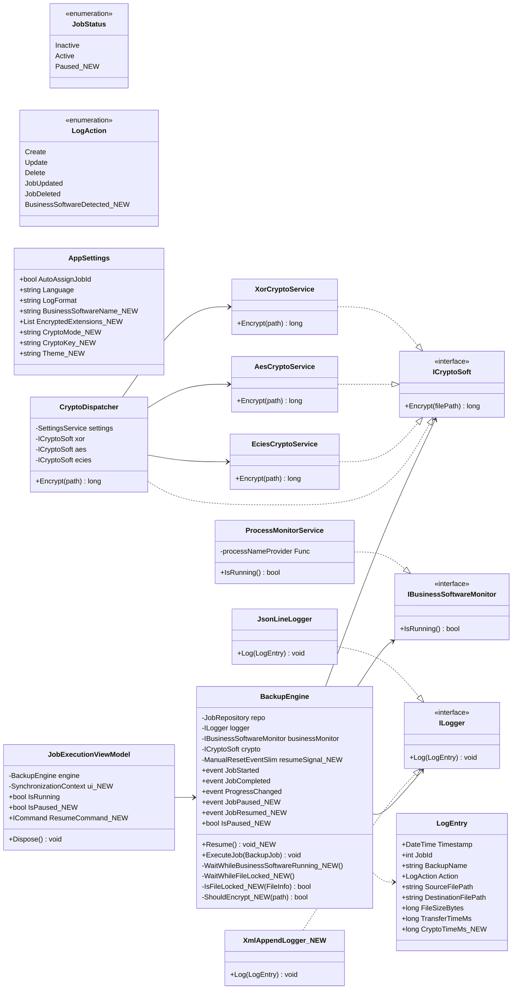
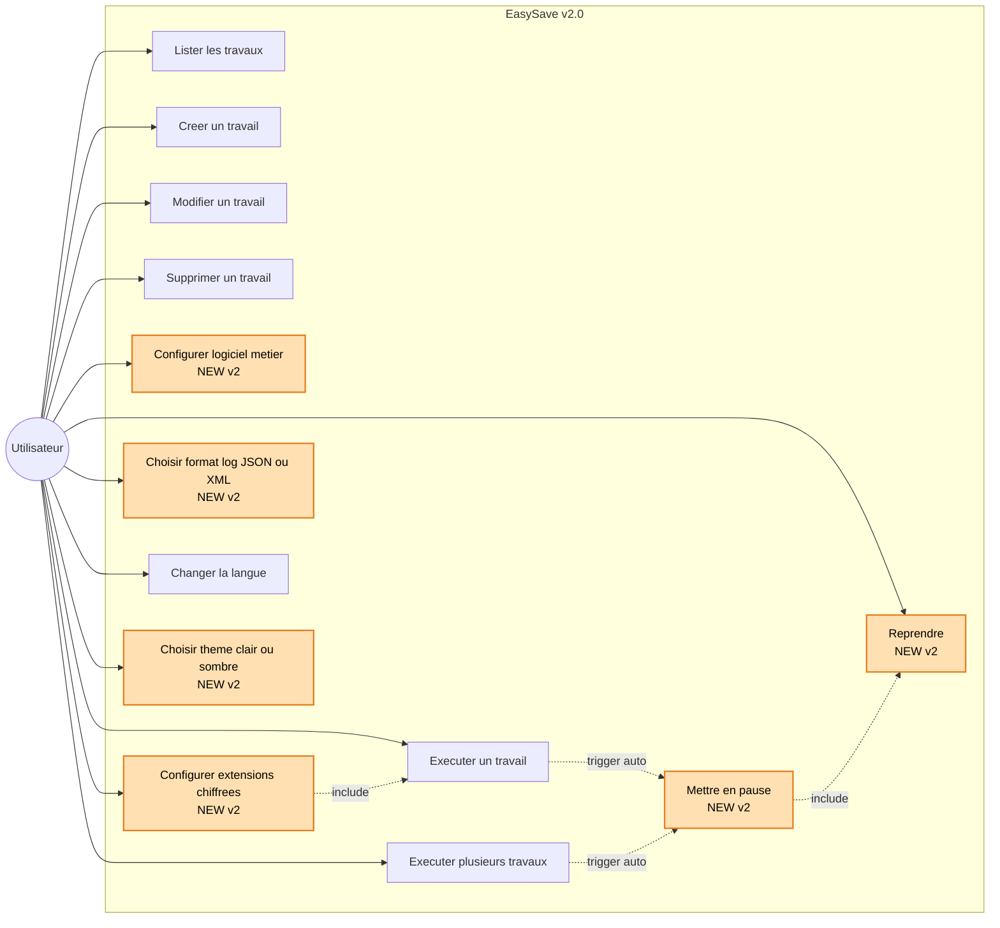
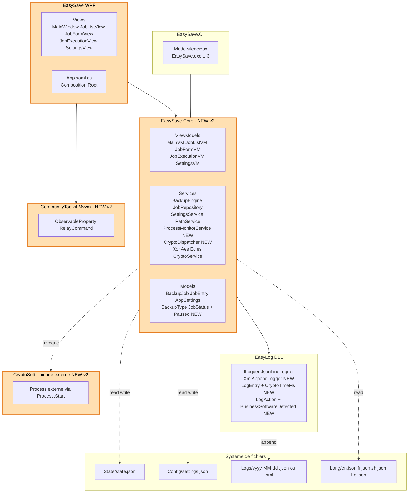
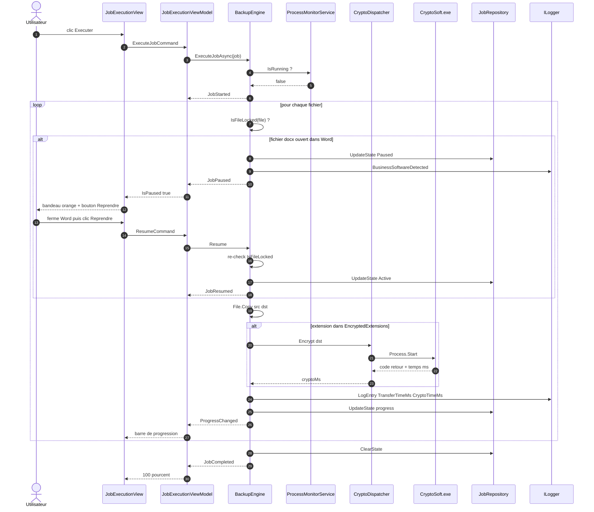
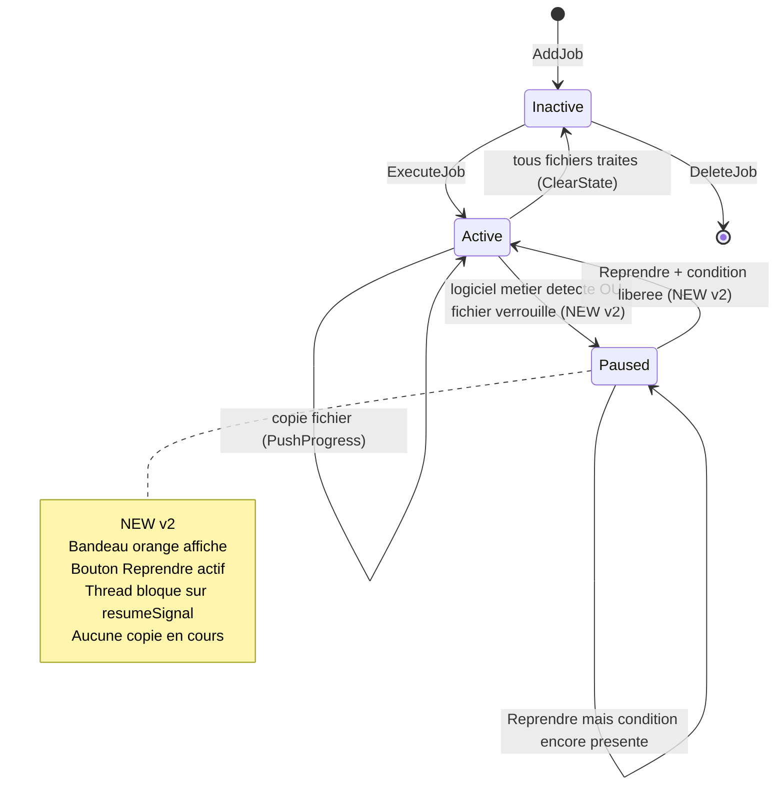
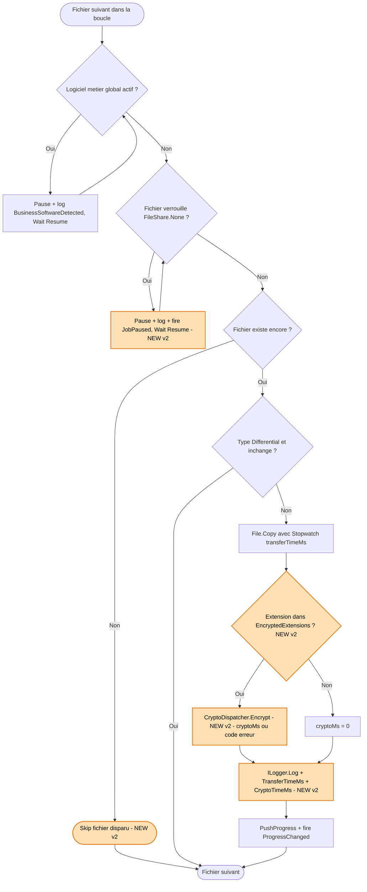

# Diagrammes UML — EasySave v2.0 (Livrable 2)

Diagrammes Mermaid centrés sur les **nouveautés du livrable 2** par rapport à v1.0 :

- Interface graphique **WPF MVVM** (remplace la console).
- Travaux **illimités** (suppression de la limite à 5).
- **Cryptage** via CryptoSoft (sélection par extensions configurables).
- Log enrichi avec **CryptoTimeMs**.
- **Détection du logiciel métier** + pause/reprise + bouton *Reprendre*.
- Format de log **XML ou JSON** sélectionnable.

---

## 1. Diagramme de classes — Cryptage + Logiciel métier + WPF

---

## 2. Diagramme de cas d'utilisation — nouveautés v2

---

## 3. Diagramme de composants / packages — nouvelle architecture v2

---

## 4. Diagramme de séquence — Sauvegarde avec pause + reprise + cryptage

---

## 5. Diagramme d'états — JobStatus enrichi avec Paused

---

## 6. Diagramme d'activité — Cycle d'un fichier (avec cryptage et pause)

---

## Récap des nouveautés UML par rapport au livrable 1

| Catégorie | v1.0 | v2.0 |
|---|---|---|
| Interface | Console | **WPF MVVM** + `EasySave.Core` partagé |
| Travaux max | 5 | **illimité** (vérification supprimée) |
| Logiciel métier | absent | **`IBusinessSoftwareMonitor` + `ProcessMonitorService`** |
| Pause / Reprise | absent | **`JobStatus.Paused`, `Resume()`, events `JobPaused` / `JobResumed`** |
| Cryptage | absent | **`ICryptoSoft` + `CryptoDispatcher` (XOR / AES / ECIES) + `CryptoSoft.exe`** |
| Format log | JSON only | **JSON _ou_ XML** (`JsonLineLogger` / `XmlAppendLogger`) |
| LogEntry | sans crypto | **+ `CryptoTimeMs`** |
| LogAction | 5 valeurs | **+ `BusinessSoftwareDetected`** |
| AppSettings | 4 champs | **+ `BusinessSoftwareName`, `EncryptedExtensions`, `CryptoMode`, `CryptoKey`, `Theme`** |
| Thread UI | sync | **`Task.Run` + `SynchronizationContext` marshalling dans VM** |
