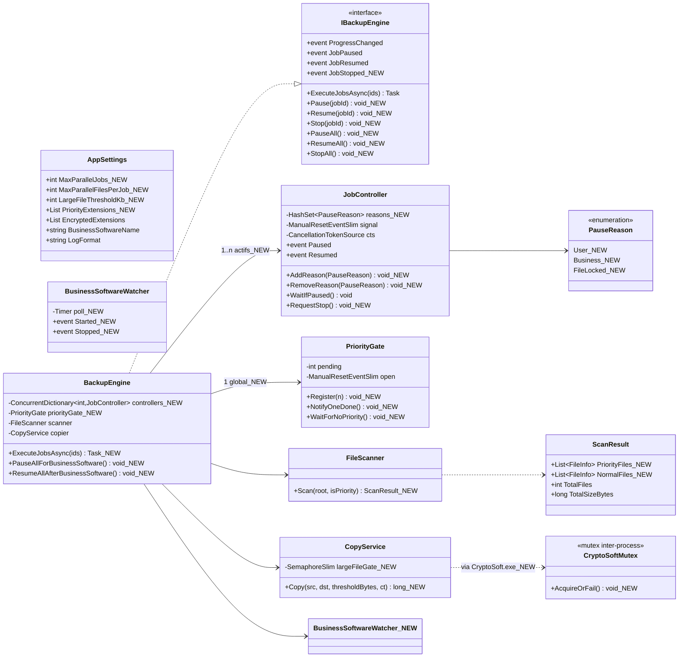
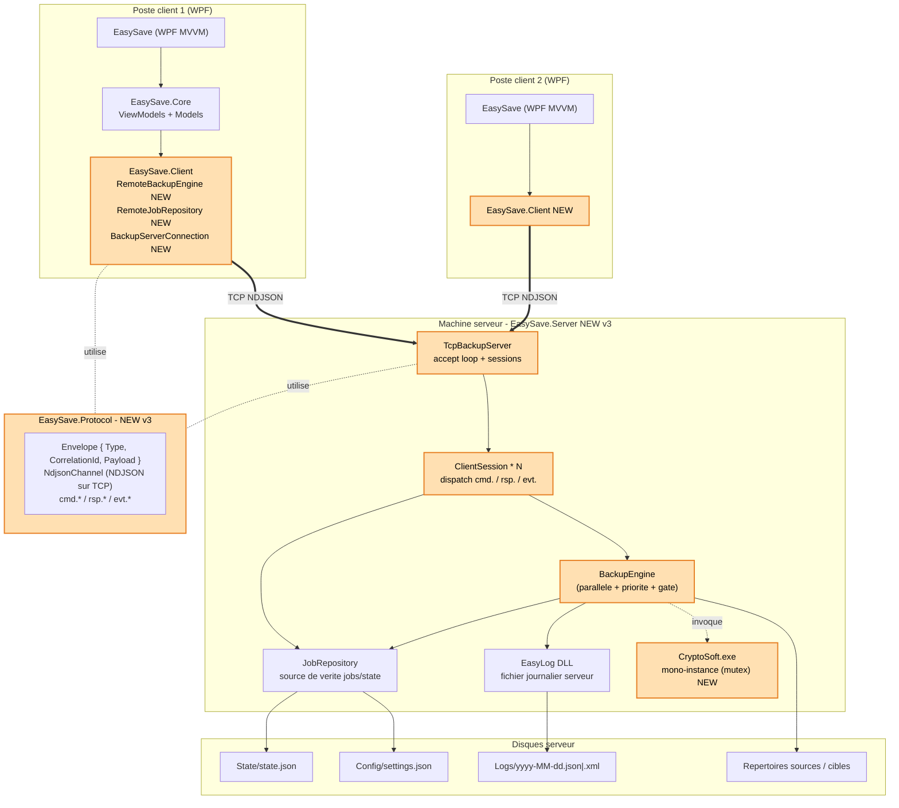
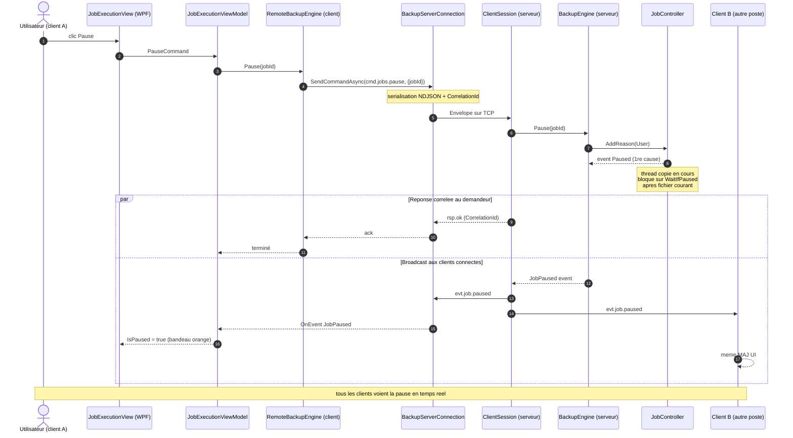

# Diagrammes UML — EasySave v3.0 (Livrable 3)

Diagrammes Mermaid centrés sur les **nouveautés du livrable 3** par rapport à v2.0 :

- **Sauvegarde en parallèle** (abandon du séquentiel) + parallélisme intra-job.
- **Fichiers prioritaires** : aucun fichier non prioritaire ne démarre tant qu'il reste des extensions prioritaires en attente sur au moins un job (barrière globale).
- **Limite gros fichiers** : interdiction de copier simultanément deux fichiers > *n* Ko (paramétrable).
- **Play / Pause / Stop** par travail ou pour l'ensemble + pause auto si logiciel métier détecté.
- **CryptoSoft mono-instance** (mutex inter-processus).
- **Architecture client / serveur TCP** : l'application est désormais accessible à distance — un serveur (`EasySave.Server`) héberge le moteur de sauvegarde, les clients WPF s'y connectent en TCP / NDJSON pour piloter les jobs en temps réel.

---

## 1. Diagramme de classes — Moteur parallèle + priorité + contrôle multi-causes

---

## 2. Diagramme de composants — Architecture client / serveur TCP (accès distant)

> Les clients WPF n'embarquent plus le moteur : ils délèguent toutes les opérations (CRUD jobs, run, pause, resume, stop, settings) au serveur via le protocole NDJSON. Le serveur diffuse en retour les événements de progression à **tous** les clients connectés (broadcast).

---

## 3. Diagramme de séquence — Pause temps réel d'un job distant

---

## Récap des nouveautés UML par rapport au livrable 2

| Catégorie | v2.0 | v3.0 |
|---|---|---|
| Exécution | Mono / séquentielle | **Parallèle multi-jobs + parallèle intra-job** |
| Pause / Reprise | 1 cause (logiciel métier) | **Multi-causes** `PauseReason.{User, Business, FileLocked}` |
| Stop | absent | **`Stop(jobId)` + `StopAll()`** via `CancellationToken` |
| Fichiers prioritaires | absent | **`PriorityGate` global** (barrière inter-jobs) |
| Gros fichiers | absent | **`largeFileGate` (SemaphoreSlim 1)** + seuil paramétrable |
| Logiciel métier | bloque le démarrage | **Pause/reprise auto** via `BusinessSoftwareWatcher` |
| CryptoSoft | multi-instances | **Mono-instance** via mutex inter-processus |
| Architecture | monolithe WPF local | **Client / serveur TCP** (`EasySave.Server`, `EasySave.Client`, `EasySave.Protocol`) — pilotage à distance, broadcast d'événements |
